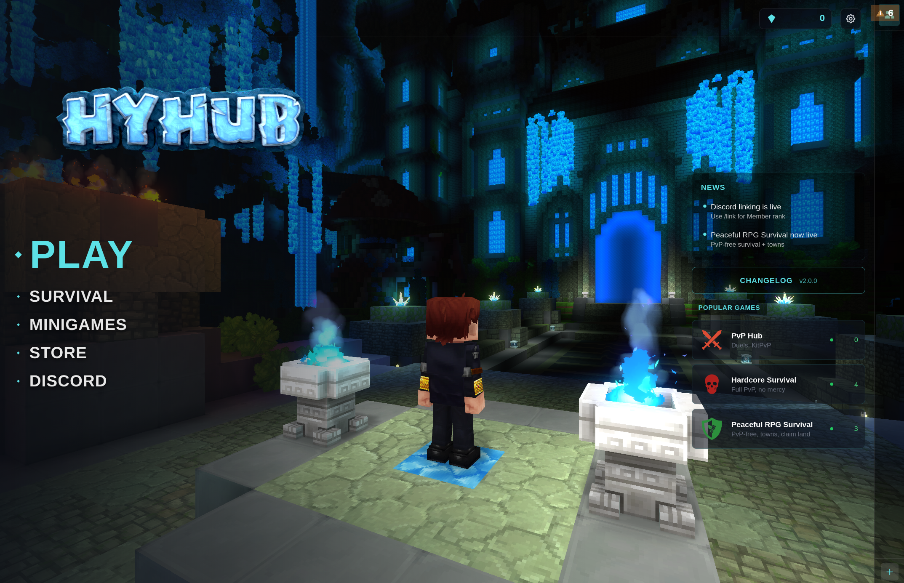

# html2hytale



(Live demo at play.hyhub.net)

## Work in progress

- Generate patch files for containers instead of large screenshots
- Detect layout automatically
- Detect flex automatically
- Detect spacing automatically
- Add Neosis support whenever that comes out
- Optimize gradient compression with stretching
- Fix bleed hitboxes when adding it for glow effects

Convert HTML + Tailwind pages into Hytale Custom UI assets:

- `.ui` documents (Hytale UI markup)
- PNG textures (including button state textures and shared deduplicated textures)
- optional preview HTML for local inspection

This tool is a Bun/TypeScript CLI (`src/index.ts`) that renders pages in headless Chrome, captures element textures, and emits Hytale UI markup.

## Hytale Custom UI context

Relevant docs:

- Official Custom UI type docs: https://hytalemodding.dev/en/docs/official-documentation/custom-ui/type-documentation
- Official markup syntax docs: https://hytalemodding.dev/en/docs/official-documentation/custom-ui/markup
- Plugin UI guide (resource placement/loading): https://hytalemodding.dev/en/docs/guides/plugin/ui

In a mod/plugin project, `.ui` files should be packaged under:

`src/main/resources/Common/UI/Custom/`

At runtime, Java UI code appends these documents by path (for example `uiCommandBuilder.append("MyUI.ui")` for `.../Common/UI/Custom/MyUI.ui`).
For plugin packaging, ensure your `manifest.json` enables assets (`"IncludesAssetPack": true`) so these UI resources are bundled.

## Prerequisites

- [Bun](https://bun.sh/) installed
- Chrome/Chromium available for `puppeteer-core`
  - Resolution order:
    1. `CHROME_PATH` environment variable
    2. **Linux:** `/usr/bin/google-chrome-stable`, `/usr/bin/google-chrome`, `/opt/google/chrome/chrome`
    3. **Windows:** `Program Fi/les\Google\Chrome\Application\chrome.exe`, `Program Files (x86)\...`, `%LOCALAPPDATA%\Google\Chrome\Application\chrome.exe`

## Installation

```bash
bun install
```

## Usage

```bash
bun run src/index.ts \
  --input ./ui-source \
  --out-resources ./src/main/resources \
  --out-ui ./src/main/resources/Common/UI/Custom/MyMod \
  --namespace MyMod \
  --viewport 1920x1080
```

### CLI flags

| Flag | Required | Description | Default |
| --- | --- | --- | --- |
| `--input <dir>` | yes | Input root containing `pages/`, optional `static-pages/`, and `tailwind.config.js` | - |
| `--out-resources <dir>` | yes | Resource root where textures/static screenshots are written (`Common/UI/Custom/<namespace>/...`) | - |
| `--out-ui <dir>` | yes | Output directory for generated `.ui` files and per-page hash files | - |
| `--out-html <dir>` | no | Preview HTML output directory (`<page>.html`) and internal render files (`_render/`) | `<out-resources>/../html` |
| `--viewport <WxH>` | no | Rendering viewport (for layout and screenshots) | `1920x1080` |
| `--namespace <name>` | no | UI namespace used for texture paths and resource folder names | `HTML` |
| `--check` | no | Enable per-page hash checking and skip unchanged pages | enabled unless `--force` is set |
| `--force` | no | Regenerate all pages regardless of hash state | `false` |
| `--strict-validate` | no | Fail generation when `.ui` validation finds schema/type issues (unknown elements/properties, invalid enum values, malformed values) | `false` |

Notes:

- If neither `--check` nor `--force` is provided, check mode is on.
- If `--force` is provided, pages are regenerated even if hash files match.
- Generated `.ui` files are validated against official Custom UI docs during generation; validation issues are warnings by default.
- Use `--strict-validate` to turn validation issues into a failing run.

Standalone validator:

```bash
bun run src/validator.ts path/to/file.ui
```

The command exits with code `1` when validation issues are found.

## Input directory structure

```text
ui-source/
├── pages/                  # HTML pages -> .ui + textures
│   ├── shop.html
│   └── settings.html
├── static-pages/           # HTML pages -> full-page PNG only
│   └── splash.html
├── tailwind.config.js      # required
├── shared.css              # optional, top-level *.css included in page hashing
└── shared.js               # optional, top-level *.js included in page hashing
```

Behavior:

- `pages/*.html` produce `.ui` files and textures.
- `static-pages/*.html` produce `static-pages/<name>@2x.png` screenshots.
- If both folders are missing/empty, the tool exits without generation.

## Output structure

Example when:

- `--out-resources src/main/resources`
- `--out-ui src/main/resources/Common/UI/Custom/MyMod`
- `--namespace MyMod`

```text
src/main/resources/
└── Common/
    └── UI/
        └── Custom/
            └── MyMod/
                ├── shop.ui
                ├── settings.ui
                ├── .hash-shop
                ├── .hash-settings
                ├── Shared/
                │   ├── t<sha256>@2x.png
                │   └── t<sha256>@2x.png
                └── static-pages/
                    └── splash@2x.png

# preview html output
<out-html>/
├── shop.html
├── settings.html
└── _render/
    ├── shop.html
    └── settings.html
```

## Supported `data-hy-*` attributes

### Identity and layout

| Attribute | Effect |
| --- | --- |
| `data-hy-id` | Primary element identifier for generated UI IDs. |
| `data-hy-anchor="..."` | Anchor tokens (`left`, `right`, `top`, `bottom`, `width`, `height`) mapped to `.ui` `Anchor`. |
| `data-hy-layout="..."` | Container layout mode mapped to `.ui` `LayoutMode` (`Top`, `Bottom`, `Left`, `Right`, `Center`, `Middle`, `Full`, `TopScrolling`, `LeftCenterWrap`, `CenterMiddle`, `MiddleCenter`, `none`). |
| `data-hy-flex="N"` | Mapped to `.ui` `FlexWeight`. If absent, CSS `flex-grow` may be used. |
| `data-hy-spacing="N"` | Adds spacing between generated children for layout containers. |

### Labels and text

| Attribute | Effect |
| --- | --- |
| `data-hy-role="label"` | Treat element as a `Label` (no texture capture). |
| `data-hy-text` | Label text value. |
| `data-hy-text-binding` | Label binding expression (`Text: binding`). |
| `data-hy-font` | Label style `FontName` (`Default`, `Secondary`, `Mono`, etc.). |
| `data-hy-valign` | Label vertical alignment mapping (`top`/`middle`/`bottom` -> `Start`/`Center`/`End`). |
| `data-hy-max-lines` | Parsed as label metadata in the pipeline (currently not emitted as a `.ui` style field by this build). |

### Rendering controls

| Attribute | Effect |
| --- | --- |
| `data-hy-skip-render` | Skip element generation. |
| `data-hy-backdrop` | Marks backdrop element and skips direct generation. |
| `data-hy-use-backdrop` | Keeps backdrop elements visible during screenshot capture of this element. |
| `data-hy-bleed="N"` | Expands screenshot bounds by `N` pixels per side. |
| `data-hy-scene-blur` | Treated as scene blur marker; emits `SceneBlur {}` in output. |

### Visibility and state

| Attribute | Effect |
| --- | --- |
| `data-hy-hidden` | Emits `Visible: false`. |
| `data-hy-visible="false"` | Emits `Visible: false` (alternate form). |
| `data-state="disabled|selected|focus"` | Controls generated state textures/properties. |
| `disabled` | Marks element disabled; affects button disabled state generation. |

### Visual and interaction extras

| Attribute | Effect |
| --- | --- |
| `data-hy-clip` | Parsed as clip intent (also inferred from CSS overflow hidden). |
| `data-hy-tooltip` | Emits `TooltipText`. |
| `data-hy-outline="<size> <color>"` | Emits `OutlineSize` and `OutlineColor`. |
| `data-hy-hit-test` | Emits `HitTestVisible: true`. |
| `data-hy-mask` | Emits `MaskTexturePath`. |

## Important generation behavior and edge cases

- Elements without `data-hy-id` **and** without regular `id` are skipped.
- `<button>`, `<a>`, selected `<input>` types, and `data-hy-role="button"` are treated as buttons.
  - Generated button states include `Default`, `Hovered`, `Pressed`, and conditional `Disabled`.
- Elements with `data-state="selected"` or `data-state="focus"` generate additional textures for those states.
- Label elements do not produce screenshot textures; they become `.ui` `Label` nodes.
- Elements fully outside the viewport are skipped with warnings.
- Tailwind config is required at `<input>/tailwind.config.js`.

## Texture deduplication

Shared textures are written under:

`Common/UI/Custom/<namespace>/Shared/`

Deduplication strategy:

- Exact duplicates: merged by content hash.
- Near duplicates: merged when similarity is at least **99.9%**, capped by mismatch thresholds (max 64 mismatched pixels with channel tolerance).
- Shared texture key format: `t<sha256>`
- File format on disk: `t<sha256>@2x.png`
- `.ui` references use namespace-relative path: `<namespace>/Shared/t<sha256>.png`

## Gradle integration

See [`example/build.gradle.kts`](example/build.gradle.kts) for a complete `generateUI` task.

That example:

- runs `bun run src/index.ts`
- wires mod-friendly input/output paths
- sets namespace and viewport
- uses `--check` for skip-if-unchanged behavior
- declares Gradle inputs/outputs for up-to-date checks
- makes `processResources` depend on `generateUI`

Example commands:

```bash
# generate UI assets explicitly
./gradlew generateUI

# build (processResources triggers generateUI)
./gradlew build

# force full regeneration (example script supports -PuiForce=true)
./gradlew generateUI -PuiForce=true

# or force task rerun from Gradle side
./gradlew generateUI --rerun-tasks
```

## Development workflow

1. Edit HTML in `ui-source/pages/` (and optional `static-pages/`).
2. Run `generateUI` (Gradle) or `bun run src/index.ts ...` directly.
3. Review generated preview HTML in `--out-html`.
4. Build/package your mod with generated `.ui` + texture assets in resources.
